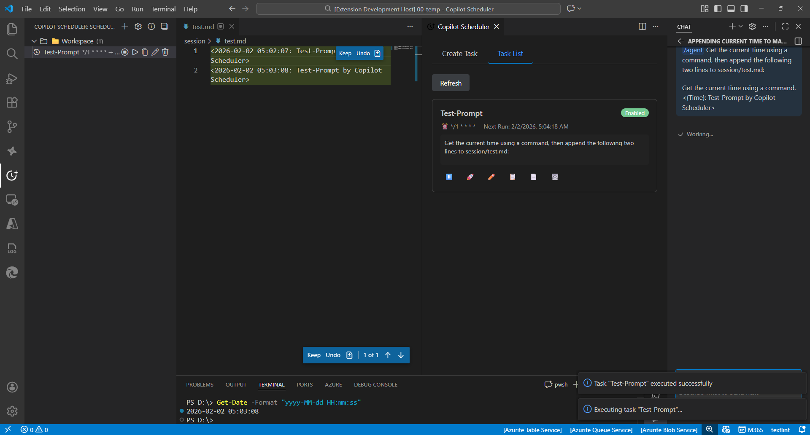

# ⏰ Copilot Scheduler

Schedule automatic AI prompts with cron expressions in VS Code.

[**📥 Install from VS Code Marketplace**](https://marketplace.visualstudio.com/items?itemName=yamapan.copilot-scheduler)

[Japanese / 日本語版はこちら](README_ja.md)

## 🎬 Demo

## ✨ Features

🗓️ **Cron Scheduling** - Schedule prompts to run at specific times using cron expressions

🤖 **Agent & Model Selection** - Choose from built-in agents (@workspace, @terminal) and AI models (GPT-4o, Claude Sonnet 4), including runtime quality or experimental quality variants when available

🌐 **Multi-language Support** - English and Japanese UI with auto-detection

📊 **Sidebar TreeView** - Manage all scheduled tasks with human-readable schedule summaries

🖥️ **Webview GUI** - Easy-to-use graphical interface for creating and editing tasks

🛠️ **Copilot Chat Tools** - Query, create, update, delete, and enable/disable scheduled tasks from agent mode using Language Model Tools

📎 **Attachments** - Attach instructions, prompts, skills, or any workspace file to a task so they are sent with the prompt

## ⏰ Cron Expression Examples

| Expression     | Description             |
| -------------- | ----------------------- |
| `0 9 * * 1-5`  | Weekdays at 9:00 AM     |
| `0 18 * * 1-5` | Weekdays at 6:00 PM     |
| `0 9 * * *`    | Every day at 9:00 AM    |
| `0 9 * * 1`    | Every Monday at 9:00 AM |
| `*/30 * * * *` | Every 30 minutes        |
| `0 * * * *`    | Every hour              |

The friendly cron builder applies your selected frequency, interval, time, weekday, or day-of-month to the cron expression as soon as you change the helper controls. The **Generate** button remains available as an explicit re-apply action, but you do not need to press it before saving.

The friendly cron builder only offers interval choices that can be represented exactly with standard cron. Intervals such as 40 or 90 minutes are generated as multiple cron lines instead of inaccurate expressions like `*/40 * * * *`. All generated lines belong to the same task, and the scheduler runs the task at the earliest matching next time across those lines.

Monthly friendly schedules default to days 1-28 so the task can run every month. Use a custom cron expression if you intentionally want a schedule such as the 31st that only runs in months where that day exists.

## 📋 Commands

| Command                                             | Description                                                                                                       |
| --------------------------------------------------- | ----------------------------------------------------------------------------------------------------------------- |
| `Copilot Scheduler: Create Scheduled Prompt`        | Create a new task (CLI)                                                                                           |
| `Copilot Scheduler: Create Scheduled Prompt (GUI)`  | Create a new task (GUI)                                                                                           |
| `Copilot Scheduler: List Scheduled Tasks`           | View all tasks                                                                                                    |
| `Copilot Scheduler: Edit Task`                      | Edit an existing task                                                                                             |
| `Copilot Scheduler: Delete Task`                    | Delete a task                                                                                                     |
| `Copilot Scheduler: Toggle Task (Enable/Disable)`   | Enable/disable a task                                                                                             |
| `Copilot Scheduler: Enable Task`                    | Enable a task                                                                                                     |
| `Copilot Scheduler: Disable Task`                   | Disable a task                                                                                                    |
| `Copilot Scheduler: Run Now`                        | Execute a task immediately                                                                                        |
| `Copilot Scheduler: Copy Prompt to Clipboard`       | Copy prompt to clipboard                                                                                          |
| `Copilot Scheduler: Duplicate Task`                 | Duplicate a task                                                                                                  |
| `Copilot Scheduler: Move Task to Current Workspace` | Move a workspace task here                                                                                        |
| `Copilot Scheduler: Open Settings`                  | Open extension settings                                                                                           |
| `Copilot Scheduler: Show Version`                   | Show extension version                                                                                            |
| `Copilot Scheduler: Show Execution History`         | View recent run history, including prompt source, path, hash, resolution time, and fallback reason when available |
| `Copilot Scheduler: Dump Model Catalog Diagnostics` | Dump model diagnostics                                                                                            |

## 🛠️ Copilot Chat Tools

In Copilot Chat agent mode, use the scheduler tools with `#` references:

| Tool                          | Description                                                                                                                                        |
| ----------------------------- | -------------------------------------------------------------------------------------------------------------------------------------------------- |
| `#scheduler_query`            | Read-only query. Use `kind=list`, `kind=get`, `kind=history`, `kind=preview_cron`, `kind=list_models`, or `kind=list_agents`.                      |
| `#scheduler_create_task`      | Create a scheduled task, including its model, agent, and execution controls.                                                                       |
| `#scheduler_update_task`      | Update task fields, including `model`, `agent`, `scope`, and the execution controls. Use `#scheduler_set_task_enabled` for enable/disable changes. |
| `#scheduler_delete_task`      | Delete a task after a strong confirmation that shows its name, scope, and workspace.                                                               |
| `#scheduler_set_task_enabled` | Enable or disable a task.                                                                                                                          |

For `kind=history`, the response includes `total`, returned `count`, `hasMore`, and newest-first `entries`. Legacy malformed timestamps are preserved or omitted without inventing audit times and are marked with `executedAtInvalid` / `nextRunAtInvalid` when applicable.

`kind=list` returns task metadata with a short `promptPreview` and `promptLength` instead of the prompt body, because a `local` or `global` task stores a snapshot of the whole prompt file. The write tools return the same shape in their success payloads. Use `kind=get` when the full prompt is needed; a preview must never be written back to a task.

`kind=list_models` returns the selectable model `id`s together with `supportedReasoningEfforts`, and `kind=list_agents` returns the selectable agent ids without exposing file paths. The model list is the same one the Copilot Scheduler view offers, so Chat can never pin a model you cannot see or change in the UI. Create/update accept `model` (plus optional `modelReasoningEffort`), `agent`, and the execution controls `autoMode`, `jitterSeconds`, `maxExecutionsPerDay`, `allowedTimeStart`, and `allowedTimeEnd`. A `model` id that is not in that list is rejected with the list of valid ids instead of silently falling back to the default model; passing an empty `model` clears the selection and returns the task to the default model. When the Language Model API is unavailable and only the built-in fallback catalog is known, the requested model is saved with a warning instead of being rejected.

Create/update also accept `attachments`: up to 10 entries of `{ source: "local" | "global", path }`, where the path is relative to the task's workspace folder or to the global prompts folder. Absolute paths, `..`, denied files, and `local` attachments on a global task are rejected instead of being saved.

In agent mode, Copilot can also choose these tools from natural-language requests. Examples:

- "Schedule a workspace task every weekday at 9:00 to summarize this repository."
- "Change the daily summary task to run at 10:30."
- "Use Claude Sonnet for the daily summary task."
- "Pause the release reminder task until I turn it back on."
- "Show my scheduled Copilot tasks before changing anything."

If multiple tasks could match the same name across scopes, ask Copilot to show the scheduled tasks first so it can confirm the exact task before updating, disabling, or deleting it.

Write tools are enabled by default and require a trusted workspace. Set `copilotScheduler.lmTools.enableWriteTools` to `false` to keep read-only tools available while disabling create/update/delete/enable-disable operations.

`copilotScheduler.lmTools.confirmationMode` controls only the extension-provided custom confirmation messages for write tools. VS Code or Copilot Chat may still show a generic approval dialog for extension tools, and users can use the built-in Always Allow flow when available.

Task snapshots and revision metadata are written through same-directory temporary files and atomically replaced. Empty/corrupt files and meta-less revision-zero `[]` snapshots do not override valid legacy global-state tasks, while revision-backed empty arrays remain valid deletes. Foreground saves and mirrors share one queue per destination. An atomic directory lock with heartbeat/stale recovery (via MIT-licensed `proper-lockfile`) plus a revision recheck prevents stale VS Code windows from overwriting newer tasks; stale windows reload the winning snapshot and ask the user to retry. Payload/mirror writes complete before metadata advances or the lock is released.

## ⚙️ Settings

| Setting                                     | Default           | Description                                                                                                                                                                                                                                                    |
| ------------------------------------------- | ----------------- | -------------------------------------------------------------------------------------------------------------------------------------------------------------------------------------------------------------------------------------------------------------- |
| `copilotScheduler.enabled`                  | `true`            | Enable/disable scheduled execution                                                                                                                                                                                                                             |
| `copilotScheduler.defaultScope`             | `workspace`       | Default scope                                                                                                                                                                                                                                                  |
| `copilotScheduler.language`                 | `auto`            | UI language (auto/en/ja). Applies to extension Webview/Tree UI; settings-description updates may require window reload.                                                                                                                                        |
| `copilotScheduler.timezone`                 | `""`              | Timezone for scheduling                                                                                                                                                                                                                                        |
| `copilotScheduler.jitterSeconds`            | `600`             | Max random delay (seconds) before execution (0–1800, 0 = off). Each task can override it.                                                                                                                                                                      |
| `copilotScheduler.manualRunNextRunPolicy`   | `advance`         | Next-run calculation after `Run Now`: `advance` (from existing next run) / `fromNow` (from current time)                                                                                                                                                       |
| `copilotScheduler.chatSession`              | `new`             | Default chat session behavior (new/continue). Tasks can override this in the Webview form. `continue` is usually faster.                                                                                                                                       |
| `copilotScheduler.autoModeDefault`          | `false`           | Default value for new tasks' auto-mode hint (inserts an autonomous-execution instruction at the beginning of the runtime prompt).                                                                                                                              |
| `copilotScheduler.commandDelayFactor`       | `0.8`             | Delay multiplier for Copilot command sequencing (0.1–2.0). Lower is faster, but may be less stable in some environments.                                                                                                                                       |
| `copilotScheduler.showNotifications`        | `true`            | Show notifications when tasks are executed                                                                                                                                                                                                                     |
| `copilotScheduler.notificationMode`         | `sound`           | Notification mode (sound/silentToast/silentStatus)                                                                                                                                                                                                             |
| `copilotScheduler.maxDailyExecutions`       | `24`              | Daily execution limit across all tasks (0 = unlimited, 1–100). ⚠️ Unlimited may risk API rate-limiting.                                                                                                                                                        |
| `copilotScheduler.minimumIntervalWarning`   | `true`            | Warn when cron interval is shorter than 30 minutes                                                                                                                                                                                                             |
| `copilotScheduler.globalPromptsPath`        | `""`              | Custom global prompts folder path (default: VS Code's User/prompts folder — Windows: `%APPDATA%/Code/User/prompts`, macOS: `~/Library/Application Support/Code/User/prompts`, Linux: `$XDG_CONFIG_HOME/Code/User/prompts` or `~/.config/Code/User/prompts`)    |
| `copilotScheduler.globalAgentsPath`         | `""`              | Custom global agents folder path (`*.agent.md`) (default: auto-detect VS Code's User/prompts folder and `~/.copilot/agents`; setting this overrides the default discovery roots)                                                                               |
| `copilotScheduler.promptFileFallback`       | `"snapshot"`      | What to do when a local/global prompt file cannot be read at execution time: `snapshot` (run the saved snapshot), `blockWhenResolvable` (block when the path resolves but the file is unreadable), `blockAlways` (always block). Inline prompts are unaffected |
| `copilotScheduler.logLevel`                 | `info`            | Log level (none/error/info/debug)                                                                                                                                                                                                                              |
| `copilotScheduler.executionHistoryLimit`    | `50`              | Max number of execution history entries kept for the history view (10–500)                                                                                                                                                                                     |
| `copilotScheduler.lmTools.enableWriteTools` | `true`            | Allow Copilot Chat tools to create, update, delete, and enable/disable scheduler tasks. Set to `false` to keep only read-only tools available.                                                                                                                 |
| `copilotScheduler.lmTools.confirmationMode` | `destructiveOnly` | Controls extension-provided custom confirmation messages for write tools: `always`, `destructiveOnly`, or `minimal`. VS Code/Copilot generic approval may still appear.                                                                                        |

To automatically keep AI-applied edits after review delay, configure VS Code setting `chat.editing.autoAcceptDelay` (`0` = off, `1-100` = seconds, recommended: `5`).

Task-level controls (`Chat Session`, `Max Runs/Day`, `Allowed Time Window`) are configured per task in the Webview create/edit form.

The Webview previews Copilot Chat-like thinking effort options for supported model families. If it fails, choose `Default`.

> Claude Opus/Sonnet are adaptive-thinking models. The extension writes the selected effort to the same per-model setting Copilot itself uses, but Copilot Chat governs Claude's effective thinking through adaptive thinking and may still apply `Medium`. GPT-5 family models honor the selected effort directly.

> The selected custom agent is passed through the `mode` field of VS Code's `workbench.action.chat.open`, and reasoning effort is applied by writing Copilot Chat's per-model settings — both are sent identically for every model. Whether a Claude model actually honors the custom agent and reasoning depth is decided by VS Code / Copilot Chat. If they do not seem to take effect, set `copilotScheduler.logLevel` to `debug` and open the "Copilot Scheduler" output channel: when the `Agent set:` and `Experimental model quality sync:` lines show the expected `mode` and `effective` values, the scheduler did its part and the gap is on the Copilot Chat side.

If execution feels sluggish when a task is triggered, try:

- `copilotScheduler.chatSession = continue`
- `copilotScheduler.commandDelayFactor = 0.6` (or `0.5`)
- `copilotScheduler.notificationMode = silentStatus`
- `copilotScheduler.logLevel = error` (or `none`)

## 📝 Prompt Placeholders

Use these placeholders in your prompts:

| Placeholder     | Description           |
| --------------- | --------------------- |
| `{{date}}`      | Current date          |
| `{{time}}`      | Current time          |
| `{{datetime}}`  | Current date and time |
| `{{workspace}}` | Workspace name        |
| `{{file}}`      | Current file name     |
| `{{filepath}}`  | Current file path     |

## 📂 Task Scope

- **Global**: Task runs in all workspaces
- **Workspace**: Task runs only in the specific workspace where it was created

## 📄 Prompt Templates

Store prompt templates for reuse:

- **Local**: `.github/prompts/*.md` in your workspace
- **Global**: VS Code user prompts folder (or the folder set in `copilotScheduler.globalPromptsPath`)
- The edit form keeps the prompt field **read-only** while `Local`/`Global` is selected, and refreshes it with the current prompt file content when you reopen the form or when the file changes. Use **Open prompt file** to edit the source file. Switch the source to **Inline** if you want to hand-edit the text on the task itself.
- The panel preview reads saved disk content only. At execution time, an open editor buffer is preferred; otherwise the latest saved file is read.
- A task only becomes **Inline** when you select the Inline source. Selecting a template keeps the task following that file.

Global custom agents are auto-discovered from the VS Code user prompts/customization folder and `~/.copilot/agents` when `copilotScheduler.globalAgentsPath` is empty.

This follows current Copilot custom agent and Copilot CLI file locations, but this extension only discovers agent files. Prompt templates still use the VS Code user prompts folder or `copilotScheduler.globalPromptsPath`, not `~/.copilot/prompts`, and the extension does not manage Copilot CLI sessions.

Agent definitions are refreshed automatically when you create, edit, or delete workspace `*.agent.md` / `AGENTS.md` files (or the global agent files). You can also reload them on demand with the refresh button next to the agent picker.

Only user-invocable agents appear in the picker. Agents with `user-invocable: false` in their frontmatter are subagent-only — they cannot be selected as a chat mode, so they are intentionally hidden. Agents without the field stay listed.

## 📎 Attachments

A task can carry up to 10 attachment files that are sent with the prompt, so instructions, prompt files, skills, or any other workspace file can be attached explicitly instead of being mentioned inside the prompt text.

- **Add attachment** opens a quick pick with a **Recommended** group (`AGENTS.md`, `.github/copilot-instructions.md`, `.github/prompts/`, `.github/instructions/`, `.github/skills/`) followed by the rest of the workspace. **Browse...** opens the regular file dialog.
- Attachments are stored relative to the workspace folder (`local`) or to the global prompts folder (`global`), never as absolute paths.
- **Only workspace-scoped tasks can attach workspace files.** A global task runs in any window, where the same relative path could point at a different file, so workspace attachments are rejected for them.
- Files such as `.env*`, `*.pem`, `*.key`, `id_rsa*` and anything under `secrets/` or `.ssh/` are never attached.
- **If an attachment cannot be found when the task runs, the task is skipped instead of running without it.** The run is recorded as `blocked` in the execution history and reported once per attachment set, so a renamed file does not silently stop the schedule and changing the attachments makes the next failure visible again.

## 📋 Requirements

- VS Code 1.95.0 or higher
- GitHub Copilot extension

## 🛠️ Release Automation

Maintainers can publish from GitHub Actions instead of running `vsce publish` locally.

- Push a tag in the form `vX.Y.Z` after updating `package.json` to the same version.
- GitHub Actions runs `npm ci`, `npm run compile`, `npm test`, packages a `.vsix`, publishes to VS Code Marketplace, and attaches the `.vsix` to the GitHub release.
- For ad-hoc publishing, use the `Publish Extension` workflow from the Actions tab to publish the current `package.json` version manually.
- Add the repository secret `VSCE_PAT` before using the workflow.

## ⚠️ Known Issues

- Copilot Chat API is still evolving; some features may require updates as the API stabilizes
- Model selection may not work in all configurations
- Experimental model quality relies on evolving VS Code/Copilot internals and may not work in all configurations

**Disclaimer:** This extension automates Copilot Chat. GitHub's [Acceptable Use Policies](https://docs.github.com/en/site-policy/acceptable-use-policies/github-acceptable-use-policies#4-spam-and-inauthentic-activity-on-github) prohibit "excessive automated bulk activity", the [Terms of Service § H (API Terms)](https://docs.github.com/en/site-policy/github-terms/github-terms-of-service#h-api-terms) allow account suspension for excessive API usage, and the [GitHub Copilot Additional Product Terms](https://docs.github.com/en/site-policy/github-terms/github-terms-for-additional-products-and-features#github-copilot) apply these policies directly to Copilot. Use at your own risk; your account could be rate-limited or restricted. Configure jitter/daily limits/longer intervals to reduce risk, but there is no guarantee.

Note: There are [reports](https://github.com/orgs/community/discussions/160013) of Copilot access being restricted even without using automation tools. These mitigations reduce obvious automation patterns but cannot eliminate that risk.

🐛 [Report a bug](https://github.com/aktsmm/vscode-copilot-scheduler/issues)

## 📦 Release Notes

### 0.1.0

Initial release:

- Cron-based task scheduling
- Agent and model selection
- English/Japanese localization
- Sidebar TreeView
- Webview GUI for task management
- Prompt template support

## 📄 License

[CC-BY-NC-SA-4.0](LICENSE) © [aktsmm](https://github.com/aktsmm)

---

**Enjoy scheduling your Copilot prompts!** 🚀
